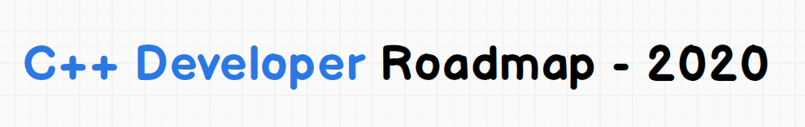

> Roadmap to becoming a C++ developer in 2020, inspired by [web-developer-roadmap](https://github.com/kamranahmedse/developer-roadmap).

Below you find a set of charts demonstrating the paths that you can take and the technologies that you would want to adopt in order to become a frontend, backend or a devops. I made these charts for an old professor of mine who wanted something to share with his college students to give them a perspective; sharing them here to help the community.

> Check out my [Github](https://github.com/utilForever) and say "hi" on [Twitter](https://twitter.com/utilForever).

***

<h3 align="center"><strong>Purpose of these Roadmaps</strong></h3>

> The purpose of these roadmaps is to give you an idea about the landscape and to guide you if you are confused about what to learn next and not to encourage you to pick what is hip and trendy. You should grow some understanding of why one tool would be better suited for some cases than the other and remember hip and trendy never means best suited for the job.

<h3 align="center"><strong>Note to Beginners</strong></h3>

> These roadmaps cover everything that is there to learn for the paths listed below. Don't feel overwhelmed, you don't need to learn it all in the beginning if you are just getting started. We are working on the beginner versions of these and will release it soon after we are done with the 2020 release of roadmaps.

***

If you think that these can be improved in any way, please do suggest.

## Introduction

Based on informations gathered from some users I decided to make it more clear. This is my version of C++ 2020 career road. I pointed some books, but you are free to use any other sources like online courses or some academic tutorials.

## C++ Roadmap

1. Learning C Language. Not only ANSI C, just modern C. It's good to start. Here are proposal of books:
C Programming Language (2nd Edition or newer) Brian W. Kernighan, Dennis M. Ritchie
C Primer Plus (6th Edition or newer) (Developer's Library) Stephen Prata

2. Learning C++ and how to avoid mistakes in your code. 
Effective C++: 50 Specific Ways to Improve Your Programs and Design Scott Meyers

3. Make sure that you know news related to C++11/14/17 and so on. Don't waste your time on learning C++98. It's deprecated.
You can browse some changes here: https://github.com/AnthonyCalandra/modern-cpp-features
If you are more advanced, you can use this book: 
Effective Modern C++. 42 Specific Ways to Improve Your Use of C++11 and C++14 also written by Scott Meyers 

4.Make sure that you are familiar with these topics: STL (Standard Template Library), synchronous computung, and more libraries. 
Here are some sources:
The C++ Standard Library: A Tutorial and Reference (2nd Edition)    Nicolai M. Josuttis
C++ Concurrency in Action, 2nd Edition      Anthony Williams
Effective STL 50 Specific Ways to Improve Your Use of the Standard Template Library Scott Meyers

5. Currently there are hardly ever amount of C++17/20 courses and tutorial books. You can track these news on blogs: 
https://www.fluentcpp.com/
https://www.bfilipek.com/

6. About Boost library the best place is Boris Schaelling's website:
https://theboostcpplibraries.com/

What's next depends on your career path.
A) Operating system programming
If you want to code some stuffs in Linux, best place to start is 
Linux System Programming: Talking Directly to the Kernel and C Library, 2nd Edition by Robert Love
And your code bible will be The Linux Programming Interface by Michael Kerrisk

About Windows or Macs
TODO
Just it's worth to mention that learning WinApi of 32 bits is nowadays deprecated.

B) Creating Graphical User Interface Application
To create GUI (and not only) you should be familiar with one of these frameworks: Qt, wxWidgets or GTK+. Qt is the most popular.

C) Creating games
Well, you can start from OpenGl (you can start learning here: https://learnopengl.com/ )
Or there is Vulkan API which is considered as successsor of OpenGl.
You can start learning by choosing one of finished, well-documented and test game engines like Unreal Engine (or Cry Engine, but there are very few sources)

C++ in embedded devices or financial industry
TODO

To be well-informed you should follow these websites: https://isocpp.org/ or
https://www.reddit.com/r/cpp/ 

Ofcourse there are many things that is good to know in spite of programming language like:
- design patterns     
Design Patterns: Elements of Reusable Object-Oriented Software
by Erich Gamma, Richard Helm, Ralph Johnson, John Vlissides

- clean code
Clean Code: A Handbook of Agile Software Craftsmanship by Robert C. Martin

- networking and how webs work (not only in Linux)

- getting familiar with command prompt / bash or any other shell

- testing your code (not only with debugger and review of changing variable values during main loop of your program).

## 🚦 Wrap Up

If you think any of the roadmaps can be improved, please do open a PR with any updates and submit any issues. Also, I will continue to improve this, so you might want to watch/star this repository to revisit.

## 🙌 Contribution

The roadmaps are built using [Balsamiq](https://balsamiq.com/products/mockups/). Project file can be found at `/project-files` directory. To modify any of the roadmaps, open Balsamiq, click **Project > Import > Mockup JSON**, it will open the roadmap for you, update it, upload and update the images in readme and create a PR.

- Open pull request with improvements
- Discuss ideas in issues
- Spread the word
- Reach out to me directly at utilforever@gmail.com or 

## License

The class is licensed under the [MIT License](http://opensource.org/licenses/MIT):

Copyright &copy; 2020 [Chris Ohk](http://www.github.com/utilForever).

Permission is hereby granted, free of charge, to any person obtaining a copy of this software and associated documentation files (the "Software"), to deal in the Software without restriction, including without limitation the rights to use, copy, modify, merge, publish, distribute, sublicense, and/or sell copies of the Software, and to permit persons to whom the Software is furnished to do so, subject to the following conditions:

The above copyright notice and this permission notice shall be included in all copies or substantial portions of the Software.

THE SOFTWARE IS PROVIDED "AS IS", WITHOUT WARRANTY OF ANY KIND, EXPRESS OR IMPLIED, INCLUDING BUT NOT LIMITED TO THE WARRANTIES OF MERCHANTABILITY, FITNESS FOR A PARTICULAR PURPOSE AND NONINFRINGEMENT. IN NO EVENT SHALL THE AUTHORS OR COPYRIGHT HOLDERS BE LIABLE FOR ANY CLAIM, DAMAGES OR OTHER LIABILITY, WHETHER IN AN ACTION OF CONTRACT, TORT OR OTHERWISE, ARISING FROM, OUT OF OR IN CONNECTION WITH THE SOFTWARE OR THE USE OR OTHER DEALINGS IN THE SOFTWARE.
